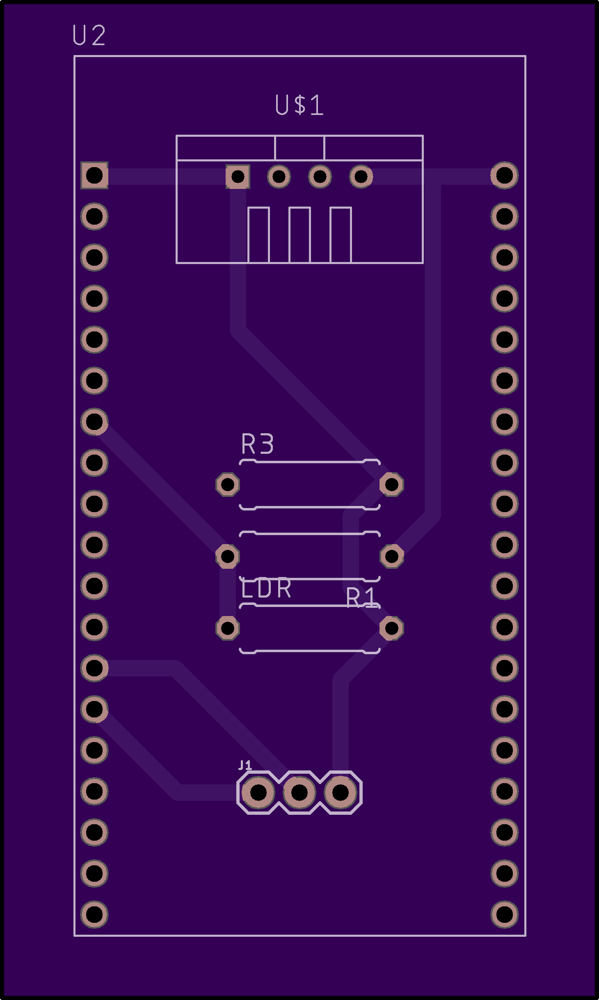
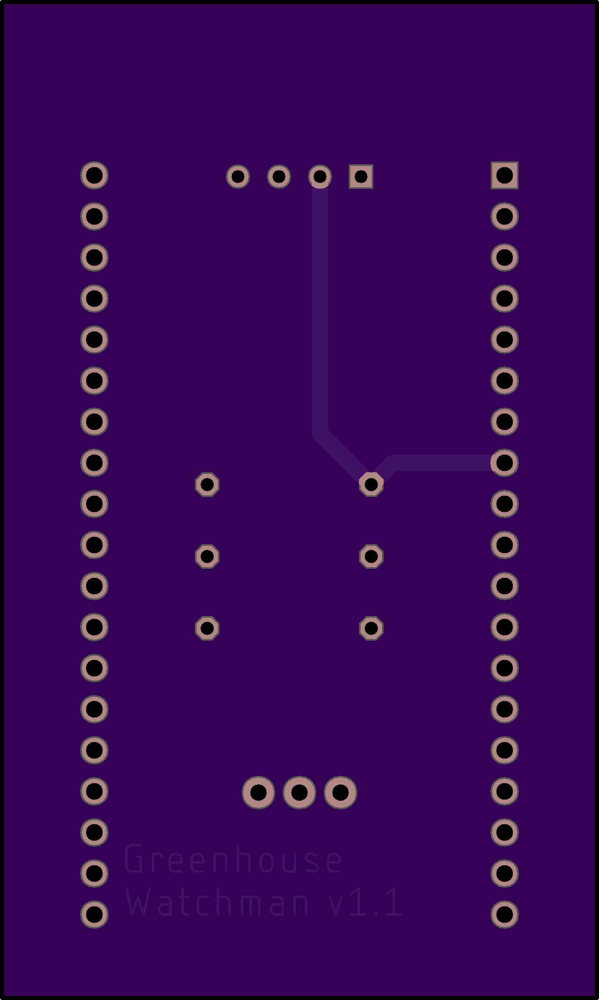

# garden-of-things

I like to be in the garden, but I also like to tinker and code.
This project is meant to combine both and turn my garden into a weird IoT version: the garden-of-things (GoT).
Let us hope that this projects starts off as well as the show but continues steadily instead of ending in a catastrophy.

## Hardware
What hardware is used and how is it set up?

### Client(s)
One (or possibly multiple) esp32 units that are equipped with various sensors
(to measure e.g. temperature, sun intensity, humidity, ...). The measured values are streamed via MQTT to a home server (e.g. a raspberry pi).
The PCB board design can be found [ħere](./resources/client_pcb_board.brd).

<table>
  <tr>
    <td>
       
    </td>  
    <td>
      
    </td>
  </tr>
</table>

### Server
A raspberry pi that has a [mosquitto mqtt broker](https://mosquitto.org/) running on it but also listens for incoming data of the client.
Once data is received, it is processed and put into a local postgres database.
The data in said database is then visualized in graphs (e.g. by using grafana, kibana or something DIY).
I also aim to make this dashboard publicly available by using some DynDNS routing.

## What is currently going on?
Check out the [CHANGELOG.md](./CHANGELOG.md) to see what is done and planned for the future.
<<<<<<< HEAD

## Notes
- Using the client code for the esp32 depends on the following repositories to be installed beforehand:
    - https://github.com/beegee-tokyo/DHTesp (for reading the DHT humidity sensor)
